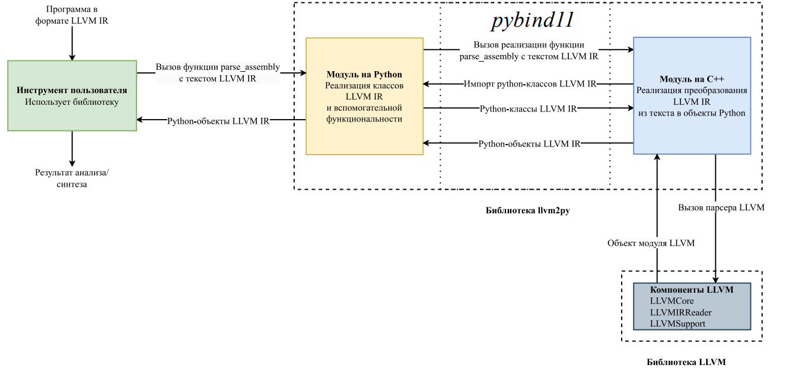
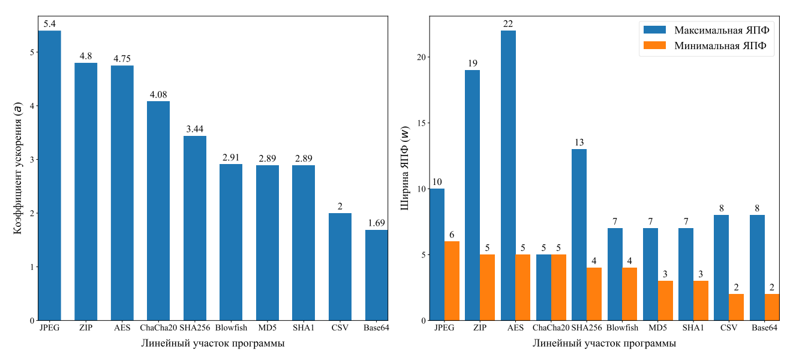
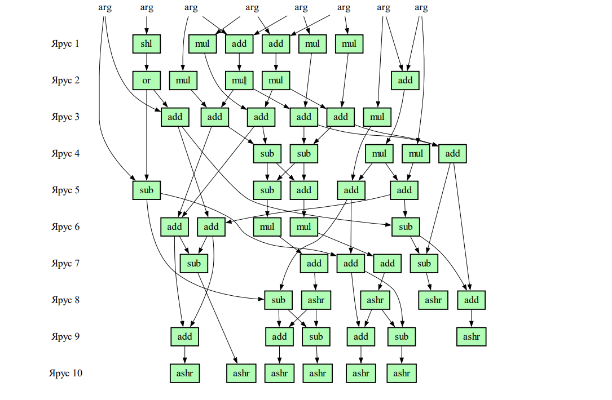

\Large УДК 004.4'4, 004.272

\begin{center}
\Large \textbf{БИБЛИОТЕКА LLVM2PY ДЛЯ АНАЛИЗА ПРОМЕЖУТОЧНОГО ПРЕДСТАВЛЕНИЯ LLVM И ЕЁ ПРИМЕНЕНИЕ В ОЦЕНКЕ СТЕПЕНИ РАСПАРАЛЛЕЛИВАНИЯ ЛИНЕЙНЫХ УЧАСТКОВ КОДА}
\end{center}

\vspace{0.6cm}

\begin{center}
\large \textbf{Павлов К.С.,Советов П.Н.}
\end{center}

\normalsize

_МИРЭА — Российский технологический университет, 119454, г. Москва, пр-т Вернадского, 78, e-mail: pavlov.k.s@edu.mirea.ru, sovetov@mirea.ru_

---

**В статье рассматриваются вопросы проектирования и использования разработанной библиотеки llvm2py, предназначенной для быстрого создания на языке Python статических анализаторов программ для промежуточного представления LLVM. Обосновывается необходимость создания рассматриваемой библиотеки, а также выбор конкретных архитектурных решений. С использованием библиотеки llvm2py разработан инструмент статического анализа степени распараллеливания линейных участков кода. Данный инструмент позволяет для конкретного линейного участка получить коэффициент его ускорения с использованием абстрактного параллельного LLVM-процессора, а также узнать минимальное число параллельно работающих функциональных узлов этого процессора, обеспечивающих максимальное значение коэффициента ускорения. Для разработанного инструмента получены экспериментальные оценки на примере десяти известных алгоритмов, реализованных на языке C. Приведена статистика распараллеливания для наиболее ускоряемого линейного участка кода каждой из программ за счёт параллелизма уровня команд. На примере тестирования алгоритма JPEG, в частности, было достигнуто ускорение выполнения линейного участка кода в 5,4 раза при минимальном использовании количества функциональных узлов процессора, равном 6 узлам.**

---

Ключевые слова: LLVM, LLVM IR, Python, llvm2py, статический анализ, распараллеливание, ярусно-параллельная форма, параллелизм уровня команд, линейный участок, граф зависимостей

\begin{center}
\Large \textbf{THE LLVM2PY LIBRARY FOR ANALYZING LLVM INTERMEDIATE REPRESENTATION AND ITS APPLICATION IN ESTIMATING PARALLELIZABILITY OF BASIC BLOCKS}
\end{center}

\vspace{0.6cm}

\begin{center}
\large \textbf{Pavlov K.S., Sovietov P.N.}
\end{center}

_MIREA - Russian Technological University, 119454, Russia, Moscow, Vernadsky Avenue, 78, e-mail: pavlov.k.s@edu.mirea.ru, sovetov@mirea.ru_

\setlength{\parskip}{0pt}

---

**The article addresses the design and utilization of the developed library, llvm2py, which is intended for the rapid
construction of static program analyzers written in Python for LLVM intermediate representation. The necessity
of the presented library is demonstrated, as are the specific architectural solutions chosen. The LLVM2Py library
has been used to develop a tool for the static analysis of parallelizability of basic blocks. The tool enables the
calculation of the acceleration coefficient for a specific basic block through the use of an abstract parallel LLVM processor. Moreover, it allows for the calculation of the minimum number of parallel functional units of the processor that provide the maximum value of the acceleration coefficient. The efficacy of the developed tool is evaluated through experimentation with ten exemplar algorithms, each implemented in the C language. The following algorithms were used for the purposes of testing: Blowfish, ZIP, JPEG, AES, Base64, ChaCha20, SHA1, CSV, SHA256, and MD5.**

**The parallelization statistics are presented for the most accelerated basic block of each program due to instructionlevel parallelism. To illustrate, the JPEG algorithm achieved a 5.4-fold acceleration of the basic block execution
with the minimum utilization of the number of functional units, which was equal to 6 units.
The developed tool, when used in conjunction with information from the profiler regarding the frequency of execution of linear sections, can assist in making informed decisions regarding the porting of code for execution to a
specialized architecture with instruction-level parallelism. The functionality of the llvm2py library is planned to
be further extended for code compilation tasks, including the creation of domain-specific compilers for specialized
processors.**

---

Keywords: LLVM, LLVM IR, Python, llvm2py, static analysis, parallelization, level-parallel form, instruction level parallelism, basic block, dependence graph

\setlength{\parindent}{15pt}
\setlength{\baselineskip}{1.5em}

**Введение**

\setlength{\baselineskip}{1.2em}
\setlength{\parskip}{0pt}

Существует потребность в разработке специализированных программных инструментов для статического
анализа и преобразований программного кода. Можно, в частности, выделить следующие задачи, решаемые с
использованием таких инструментов:

* Интеллектуальный анализ программ, в том числе анализ программ на уязвимости.
* Оценка степени распараллеливания программного кода.
* Программно-аппаратное разбиение для вычислительных систем, состоящих как из универсальных процессоров, так и множества специализированных аппаратных ускорителей.
* Разработка предметно-ориентированных компиляторов для спецпроцессоров.

Традиционно такие инструменты разрабатываются на языке C++ в рамках фреймворка LLVM с использованием промежуточного представления LLVM IR (Intermediate Representation). Использование языка LLVM IR для
представления входных программ позволяет задействовать внешние инструменты для синтаксического разбора
множества входных языков, включающее языки C и C++, а также получить оптимизированный вариант программы за счёт существующего оптимизирующего компилятора. Как следствие, использование представления
LLVM IR позволяет получить готовый набор программ для задач анализа и компиляции

Учитывая, что для узких классов задач целесообразно разрабатывать специализированные программные инструменты, возникает необходимость задействования средств быстрой разработки и прототипирования этих инструментов. В частности, использование языка Python может позволить упростить и ускорить процесс разработки
прототипов рассматриваемых инструментов. По результатам анализа существующих решений, подходящих
средств для работы с представлением LLVM IR на языке Python найдено не было, в связи с этим была разработана
библиотека llvm2py [@llvm2py], описываемая в этой статье.

Разработанная библиотека написана преимущественно на языке Python, а также имеет в своём составе модуль
на C++. Разбор синтаксиса языка LLVM IR производится синтаксическим анализатором фреймворка LLVM, а
работа с представлением LLVM IR осуществляется через программный интерфейс модуля библиотеки llvm2py
на Python, реализующего подмножество классов представления LLVM IR. Связывание модулей на Python и С++
осуществлено с помощью сторонней библиотеки pybind11 [@pybind11].

С использованием разработанной библиотеки создан инструмент статического анализа степени распараллеливания линейных участков кода, позволяющий выявить степень параллелизма уровня команд для входной программы. Анализ осуществляется с использованием графа зависимостей команд (ГЗ) и ярусно-параллельной
формы (ЯПФ), позволяющей выявить минимальное число шагов, для выполнения линейного участка на параллельном абстрактном LLVM-процессоре. С помощью минимизации ширины ярусно-параллельной формы формируются сведения о минимальном количестве параллельно работающих функциональных узлов, требуемых для
выполнения линейного участка параллельным LLVM-процессором.

Практическое использование разработанного инструмента анализа степени распараллеливания линейных
участков рассмотрено на примере ряда известных алгоритмов, реализованных на языке C. По результатам анализа выявлены наиболее перспективные линейные участки, имеющие наибольший коэффициент ускорения выполнения на абстрактном параллельном LLVM-процессоре по сравнению с последовательным LLVMпроцессором. В частности, для тестовой программы JPEG получено ускорение в 5,4 раза.

Для каждого участка была произведена минимизация ширины ЯПФ, по результатам которой достигнуто существенное сокращение числа функциональных узлов параллельного LLVM-процессора. В случае линейного
участка алгоритма AES сокращение достигает 17-и узлов. Полученные результаты могут служить основанием
для переноса выполнения программного кода на специализированную архитектуру с параллелизмом уровня команд.

**Архитектура библиотеки**

Классы фреймворка LLVM специально разработаны для достижения высоких характеристик быстродействия
и малых накладных расходов с точки зрения занимаемой памяти в процессе компиляции. Для разработки прототипов инструментов анализа программ в форме представления LLVM IR на языке Python такие жесткие требования не являются обязательными. Важным требованием при проектировании библиотеки llvm2py является обеспечение простоты взаимодействия со структурами данных подмножества LLVM IR за счёт использования базовых типов данных, встроенных в язык Python

На язык LLVM IR, в отличие от MLIR [@mlir2020], отсутствует формальная спецификация [@llvmlang]. В то же время, синтаксис LLVM IR меняется с выходом новых версий фреймворка LLVM. По этой причине воссоздание формальной
грамматики по программному коду LLVM не представляется целесообразным

В связи со сказанным выше, к проектируемой библиотеке выдвинуты следующие требования:

1. Простота предоставляемого пользователю библиотеки программного интерфейса.
2. Независимость кода библиотеки от изменений в синтаксисе языка LLVM IR.

Концептуальная схема взаимодействия с библиотекой изображена на рис. 1. Как видно из рисунка, разработанная библиотека состоит из двух модулей, написанных на языках Python и C++ соответственно. Инструмент
пользователя, осуществляющий анализ программы в представлении LLVM IR, взаимодействует с разработанной
библиотекой llvm2py через программный интерфейс модуля библиотеки на Python. Инструмент пользователя
формирует некоторый результат анализа или синтеза кода. Модуль библиотеки на C++ взаимодействует с компонентами фреймворка LLVM, в которых содержится синтаксический анализатор и классы представления LLVM
IR, а также реализует функциональность преобразования текста LLVM IR в объекты Python.

Таким образом, библиотека llvm2py использует готовый код реализации синтаксического разбора LLVM IR
из фреймворка LLVM. Этим обеспечивается независимость llvm2py от изменений в синтаксисе языка LLVM IR:
изменения в языке LLVM IR приводят лишь к перекомпиляции кода llvm2py с возможными незначительными
изменениями в программном интерфейсе взаимодействия с библиотекой LLVM. Простота программного интерфейса разработанной библиотеки достигается за счёт представления подмножества LLVM IR с помощью небольшого числа классов и встроенных типов данных языка Python.

Благодаря статическому связыванию библиотеки с компонентами LLVM, библиотека является независимой
от фреймворка LLVM, а ее размер, на момент написания этой статьи, не превышает 8 Мбайт в скомпилированном
виде

{width="6.5in"}

**Модуль на Python**

Данный модуль содержит подмножество классов LLVM, описывающих представление LLVM IR (рис. 2).
Изображённый на рис. 2 набор классов не отражает LLVM IR полностью, но позволяет решать многие задачи
анализа кода, поскольку реализует основные элементы языка LLVM IR. Библиотека llvm2py спроектирована с
возможностью расширения для решения задач, требующих более полной поддержки LLVM IR

Программу в иерархии, показанной на рис. 2, представляет класс с названием Module, который содержит в
себе множество функций (класс Function). Тело функции содержит линейные участки (Block), которые, в свою
очередь, содержат команды (Instruction). Все классы, за исключением класса Module, наследуются от класса
Value, тем самым, переиспользуя такие поля, как тип (Type) и имя. Типы и коды операций команд представляются
классами перечислений (TypeID и Opcode).

Рассматриваемый Python-модуль библиотеки предоставляет пользователю следующий программный интерфейс:

1. Функция parse_assembly, преобразующая LLVM IR из текстового вида в объекты Python.
2. Функция dump, осуществляющая отладочный вывод представления в виде объектов Python в текстовой
форме.
3. Иерархия классов, показанная на рис. 2 и реализующая подмножество классов LLVM IR.
4. Ряд вспомогательных классов-перечислений, необходимых для работы с перечислимыми полями классов,
такими как коды операций команд.

**Модуль на C++**

Данный модуль содержит реализацию функции parse_assembly, которая преобразует текст LLVM IR в объекты Python. Для реализации этой функции необходима возможность создания объектов Python из модуля на
C++. Такую возможность, как и возможность создания расширения C++ для Python предоставляет, используемый
в llvm2py, инструмент pybind11

В рамках работы функции parse_assembly выполняется разбор текста LLVM IR за счёт функциональности
средств синтаксического разбора, импортированных из фреймворка LLVM, после чего, c помощью одного обхода иерархии объектов LLVM IR на C++, выполняется создание объектов Python на основе данных из объектов
C++. В результате возвращается полученное представление подмножества LLVM IR в виде объектов Python.

{width="6.5in"}

**Анализ степени распараллеливания линейных участков**

Для современных вычислительных систем характерно наличие как универсальных процессоров, так и множества специализированных аппаратных ускорителей. В этой связи приобретает важность задача программно-аппаратного разбиения выполнения фрагментов кода с целью достижения требуемых характеристик, таких, например, как быстродействие или энергопотребление. В частности, выявление в часто исполняемом фрагменте программы высокой степени параллелизма уровня команд может быть основанием для переноса выполнения кода
на специализированный процессор с архитектурой VLIW.

Выявление степени параллелизма уровня команд может быть осуществлено с помощью статического анализа,
дополненного информацией о наиболее часто выполняемых линейных участках. Эта дополнительная информация может быть получена с помощью средств профилирования программ. С использованием библиотеки llvm2py
разработан рассматриваемый далее инструмент статического анализа степени распараллеливания на уровне линейных участков в представлении LLVM IR.
Представление LLVM IR можно рассматривать, как машинный код абстрактного LLVM-процессора с неограниченным числом регистров и единственным функциональным узлом, выполняющим команду LLVM IR за такт.

Расширением абстрактного LLVM-процессора является его вариант, обладающий бесконечным числом параллельно работающих функциональных узлов. С точки зрения анализа степени распараллеливания уровня команд
интерес представляют следующие показатели:

1. Коэффициент a ускорения выполнения линейного участка на параллельном LLVM-процессоре по сравнению с последовательным вариантом.
2. Число w параллельно работающих функциональных узлов, обеспечивающих достижение максимального
значения коэффициента ускорения.

С использованием этих показателей распараллеливания может быть осуществлен не только выбор среди существующих аппаратных решений, но и обоснование проектирования нового аппаратного ускорителя.

Каждый линейный участок анализируется инструментом анализа степени распараллеливания отдельно, в соответствии с этапами, показанными на рис. 3, а в качестве результата выдаются значения показателей распараллеливания.

{width="6.5in"}

Первым этапом осуществляется преобразование линейного участка на языке LLVM IR в ГЗ [@sovetov2021], в котором
узлы представляют собой команды, а ребра задают зависимости двух видов: по данным и по состоянию памяти.
Предполагается, что после использования опций компилятора для разворачивания циклов и встраивания функций наиболее высокий потенциал распараллеливания уровня команд имеют линейные участки, не содержащие
вызовов функций. Поэтому в ГЗ транслируются только линейные участки без вызовов функций, за исключением
вызовов встроенных функций (intrinsics), не имеющих побочного эффекта.

Следующим этапом реализуется построение ЯПФ [@fet1995]. Каждый ярус ЯПФ представляет собой множество всех
команд, выполнение которых зависит только от результатов вычисления предыдущих ярусов. Таким образом,
ярус – это шаг вычислений параллельного LLVM-процессора, причем каждая команда яруса выполняется на
своем функциональном узле. Общее количество ярусов определяет число шагов для выполнения линейного
участка. Псевдокод алгоритма построения ЯПФ приведен на рис. 4.

На вход алгоритма построения ЯПФ подается граф зависимостей G, а результатом работы алгоритма является
таблица L, в которой каждому номеру яруса соответствует множество команд, расположенных на соответствующем ярусе

{width="6.5in"}

Выполнение алгоритма продолжается, пока в графе G остаются необработанные узлы (строка 4). Основным
шагом алгоритма является определение такого узла n (строка 6), аргументы которого уже обработаны (строка 7).

Если n удовлетворяет этому условию, то узел добавляется к множеству узлов текущего яруса (строка 8). После
очередного просмотра графа G из него исключается множество узлов текущего яруса (строка 9).

Из таблицы L можно получить значение количества ярусов d, то есть минимальное число шагов параллельного LLVM-процессора, необходимых для выполнения некоторого линейного участка, а также значение $w_max –
размер наиболее широкого яруса.

Коэффициент ускорения a определяется следующим образом:

\vspace{0.6cm}
\begin{center}

$a = \frac{|G|}{d}$.

\end{center}
\vspace{0.6cm}

Рассматриваемый алгоритм относится к жадным алгоритмам, что приводит к построению ярусов максимальной ширины (максимальная ЯПФ). В этой связи возникает задача минимизации ширины ЯПФ, то есть минимизации числа используемых в вычислениях параллельно работающих функциональных узлов.

На этапе построения минимальной ЯПФ решается задача минимизации ширины ЯПФ, формулировка которой
сведена к задаче программирования в ограничениях, аналогично тому, как это сделано в [@sovietov2023]. При этом используются полученные в результате выполнения алгоритма построения ЯПФ значения d и w_max.

Номер назначенного яруса для каждого узла ГЗ содержится в переменной p:

\vspace{0.6cm}
\begin{center}

$p_n \in \{0, \ldots, d-1\}, \forall n \in G$.

\end{center}
\vspace{0.6cm}

Заданы ограничения на расположение в ярусах с учетом зависимостей между узлами – вычисленные аргументы команд должны предшествовать самим командам:

\vspace{0.6cm}
\begin{center}

$\forall n \in G, \forall a \in args(G[n]):p_a < p_n$.

\end{center}
\vspace{0.6cm}

Булева матрица $x_i,_n \in {0,1}$ определяет для каждого яруса с номером i наличие в нем узла n:

\begin{center}

\[ \forall i \in \{0, \ldots, d-1\}, \forall n \in G:
  \begin{cases}
    x_{i,n}=1 \Rightarrow p_n=i\\
    x_{i,n}=0 \Rightarrow p_n \neq i
  \end{cases}
\]  

\end{center}

Ширина каждого i-го яруса ограничивается значением максимальной ширины $w \in \{0, \ldots, w_{max}\}$:

\vspace{0.6cm}
\begin{center}

$\sum x_i \le w$.

\end{center}
\vspace{0.6cm}

Задача минимизации ширины ЯПФ с учетом заданных ограничений формулируется следующим образом:

\vspace{0.6cm}
\begin{center}

$min w$.

\end{center}
\vspace{0.6cm}

В рассматриваемом инструменте анализа степени распараллеливания решение этой задачи реализовано с помощью решателя CP-SAT из состава программного пакета OR-Tools [@ortools2023].

**Экспериментальные оценки**

Практическая применимость разработанной библиотеки llvm2py далее рассмотрена на примере использования инструмента анализа степени распараллеливания линейных участков, созданного на языке Python. Для тестирования выбраны реализации десяти известных алгоритмов на языке C.

Тестовые программы были переведены в форму LLVM IR с использованием компилятора clang 16 и следующих опций:

\vspace{0.6cm}
\begin{center}

clang -O2 -S -emit-llvm -funroll-loops -finline-functions.

\end{center}
\vspace{0.6cm}

Для каждой программы произведён статический анализ с использованием разработанного инструмента на
платформе сервиса Goo le Colab с двумя выделенными ядрами процессора Intel Xeon.

Время, затраченное на анализ каждой программы приведено в табл. 1.

Как видно из таблицы, анализ степени распараллеливания линейных участков занял приемлемое время, несмотря на использование языка Python и решение NP-трудной задачи нахождения минимальной ЯПФ.

В случае тестов Blowfish и ZIP, разительно отличающихся друг от друга количеством линейных участков,
можно видеть, что размер линейного участка оказывает существенное влияние на общее время анализа.

С использованием полученных результатов анализа для каждой программы был выбран единственный линейный участок с наибольшим коэффициентом ускорения. 

Данные по каждому выбранному участку приведены в табл. 2.

\setlength{\parindent}{0pt}
\vspace{0.4cm}

\begin{flushright}
Таблица 1 – Общее время анализа программ
\end{flushright}

\begin{tabular}{|p{2.5cm}|p{3.2cm}|p{3cm}|p{3.7cm}|p{3cm}|}
    
  \hline  
  Программа & Размер программы, команд & Количество линейных участков & Средний размер линейного участка, команд & Общее время анализа, с \\
  \hline
  Blowfish & 980 & 4 & 245 & 42.69 \\
  \hline
  ZIP & 11446 & 2666 & 4 & 37.2 \\
  \hline
  JPEG & 1416 & 223 & 6 & 6.09 \\
  \hline
  AES & 126 & 2 & 63 & 1.14 \\
  \hline
  Base64 & 367 & 117 & 3 & 0.96 \\
  \hline
  ChaCha20 & 146 & 3 & 48 & 0.49 \\
  \hline
  SHA1 & 198 & 19 & 10 & 0.48 \\
  \hline
  CSV & 240 & 92 & 2 & 0.43 \\
  \hline
  SHA256 & 133 & 14 & 9 & 0.26 \\
  \hline
  MD5 & 55 & 10 & 5 & 0.18 \\
  \hline
\end{tabular}

\vspace{0.2cm}

\begin{flushright}
Таблица 2 – Выбранные линейные участки программ
\end{flushright}

\begin{tabular}{|p{5.3cm}|p{5.7cm}|p{5.3cm}|}

  \hline  
  Программа & Линейный участок в формате
функция.%номер & Количество команд линейного
участка \\
  \hline
  AES & main.\%125 & 114 \\
  \hline
  
  ChaCha20 & main.\%33 & 98 \\
  \hline
  JPEG & njDecode.\%776 & 54 \\
  \hline
  Base64 & base64\_encode.\%22 & 49 \\
  \hline
  Blowfish & blowfish\_key\_setup.\%6 & 32 \\
  \hline
  SHA256 & sha256\_transform.\%79 & 31 \\
  \hline
  MD5 & md5\_transform.\%4 & 26 \\
  \hline
  SHA1 & sha1\_transform.\%4 & 26 \\
  \hline
  ZIP & tdefl\_compress\_normal.\%1 & 24 \\
  \hline
  CSV & CsvReadNextRow.\%62 & 16 \\
  \hline
  
\end{tabular}

\setlength{\parindent}{15pt}

Значения ширины ЯПФ до и после минимизации, а также коэффициенты ускорения для выбранных линейных участков из табл. 2 приведены в диаграммах на рис. 5.

\vspace{7.5cm}

{width="5.8in"}

На левой диаграмме приведены полученные для линейных участков тестовых программ коэффициенты ускорения a. Самым распараллеливаемым оказался линейный участок программы JPEG, в то время как линейные
участки MD5 и Blow ish подвержены распараллеливанию в меньшей степени, чем линейный участок AES. Правая диаграмма показывает разницу между наибольшей шириной яруса w первоначального варианта ЯПФ и варианта с минимизированной шириной. Видно, в частности, что благодаря нахождению минимальной ЯПФ удаётся сэкономить 17 функциональных узлов для теста AES.

В разработанном инструменте анализа степени распараллеливания присутствуют средства визуализации
ЯПФ. Пример минимальной ЯПФ для линейного участка алгоритма JPEG приведен на рис. 6. Для сокращения
деталей в аргументах линейного участка убраны индексы, а результаты не отображены.

{width="5.7in"}

Как видно из рис. 6, линейный участок состоит только из вычислительных команд и обладает большим потенциалом распараллеливания, то есть может быть рассмотрен вопрос о переносе выполнения части кода JPEG
на специализированную архитектуру с параллелизмом уровня команд. При этом необходимо учесть также информацию от профилировщика по поводу частоты выполнения анализируемых линейных участков в программе.

**Анализ существующих решений**

Библиотека llvmlite [@llvmlite] позволяет порождать промежуточное представление LLVM IR на основе кода на языке
Python и применяется, преимущественно, для задач JIT-компиляции. При попытке применения этой библиотеки
для решения задач анализа существующих программ на языке LLVM IR обнаружилось, что llvmlite не предоставляет детальной информации об аргументах команд, что, в свою очередь, не позволяет полагаться на эту библиотеку в решении многих задач статического анализа.

Библиотека pyMLIR [@pymlir] реализует разбор промежуточного представления MLIR и предоставляет ряд инструментов для работы с данным представлением. Она может быть применена для некоторых задач статического
анализа кода, однако MLIR не порождают такие компиляторы, как clang, а для проведения большей части машинно-независимых оптимизаций необходимо транслировать MLIR в LLVM IR, что ограничивает применение
этой библиотеки.

В [@bennun2018] описан программный инструмент, реализующий разбор представления LLVM IR с использованием
механизма регулярных выражений. Такой подход отличается чрезвычайно громоздкостью: суммарный объём исходного кода разбора на Python составляет более трех тысяч строк. С учётом темпов развития LLVM, такое решение нельзя назвать удовлетворительным, так как его корректность может быть нарушена из-за изменений в
синтаксисе языка LLVM IR, причём подобные изменения затруднительно отслеживать ввиду отсутствия формальной спецификации на язык LLVM IR.

**Заключение**

В этой статье были рассмотрены вопросы проектирования и использования библиотеки llvm2py, предназначенной для быстрой разработки на языке Python специализированных программных инструментов статического
анализа и преобразований программного кода, представленного в форме LLVM IR. Разбор синтаксиса языка
LLVM IR реализуется в библиотеке с использованием синтаксического анализатора фреймворка LLVM, а работа
с представлением LLVM IR осуществляется через программный интерфейс библиотеки, реализующей подмножество классов представления LLVM IR на Python.

С использованием данной библиотеки был разработан инструмент анализа степени распараллеливания линейных участков кода. Его тестирование на программах, реализующих известные алгоритмы на языке C, показало, что использование параллелизма уровня команд позволило бы ускорить выполнение линейных участков в
некоторых случаях до 5,4 раз, как это было показано на примере теста JPEG.

Разработанный инструмент, дополненный информацией со стороны профилировщика о частоте выполнения
линейных участков, может способствовать принятию взвешенных решений о переносе выполнения частей кода
на специализированную архитектуру с параллелизмом уровня команд.

Функциональность библиотеки llvm2py в дальнейшем планируется расширить для задач компиляции кода,
таких как создание предметно-ориентированных компиляторов для спецпроцессоров.

\vspace{2.0cm}

\begin{center}

\textbf{Список литературы}

\end{center}

---